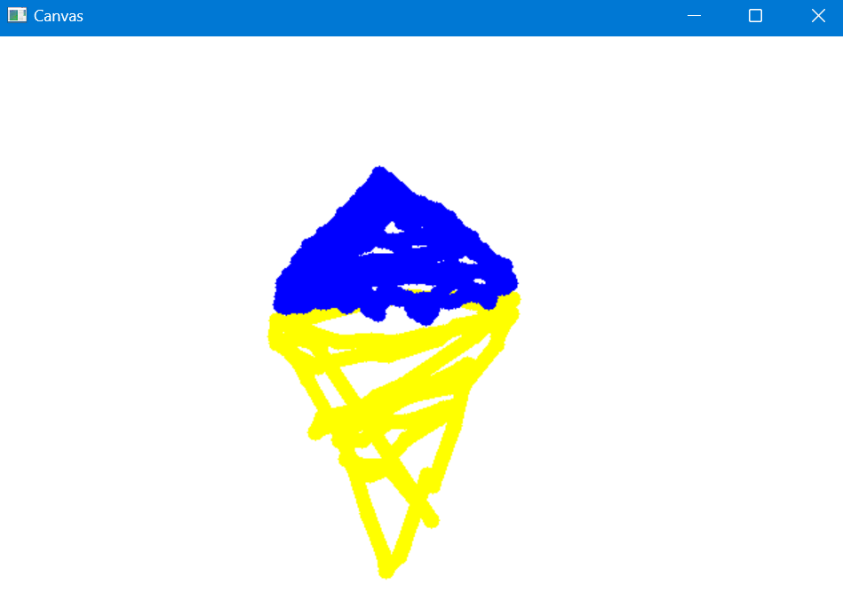
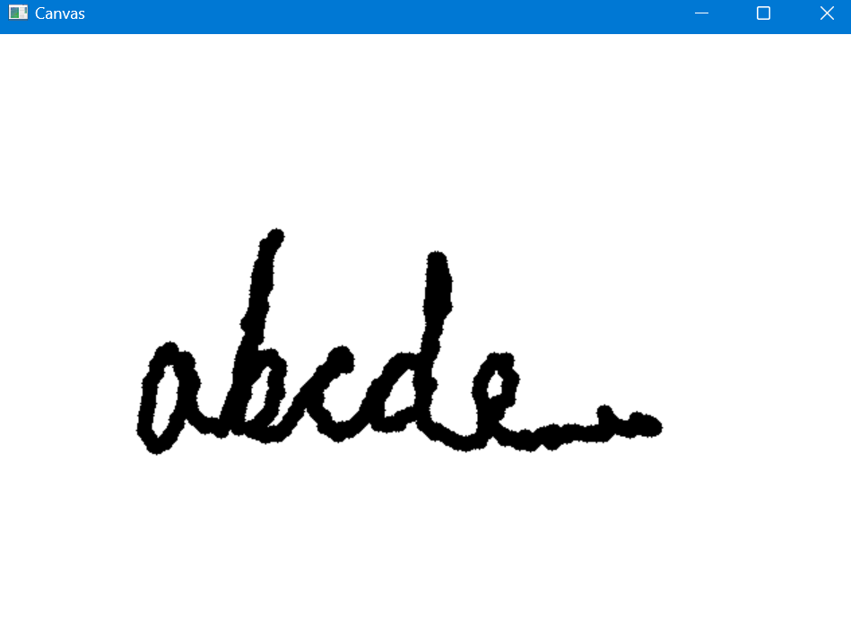

<h1>Air Paint</h1>
A Computer Vision project that allows you to paint by moving your finger in the air like a brush.
The program uses OpenCV to video capture and Mediapipe Hands to detect the index finger of the user.</h2>
<h3>Technologies Used</h3>
<ul>
  <li>Python 3.11.3</li>
  <li>IDE- Spyder 5.4.3</li>
  <li>Libraries used-</li>
  <ul>
    <li>OpenCV</li>
    <li>MediaPipe</li>
    <li>NumPy</li>
  </ul>
</ul>
<h3>Screenshots</h3>

