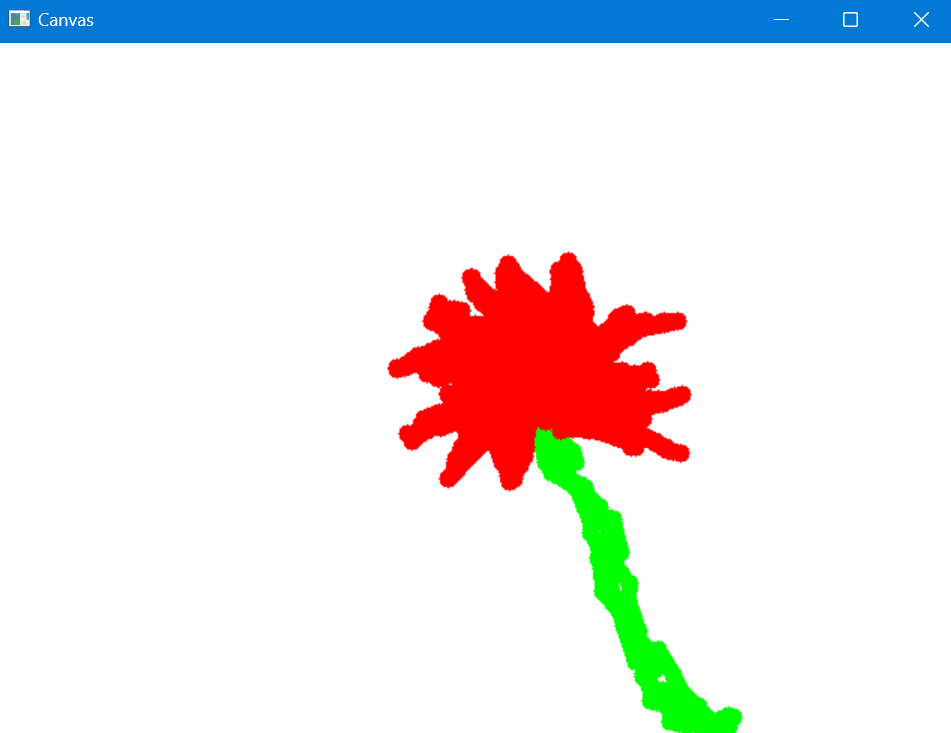
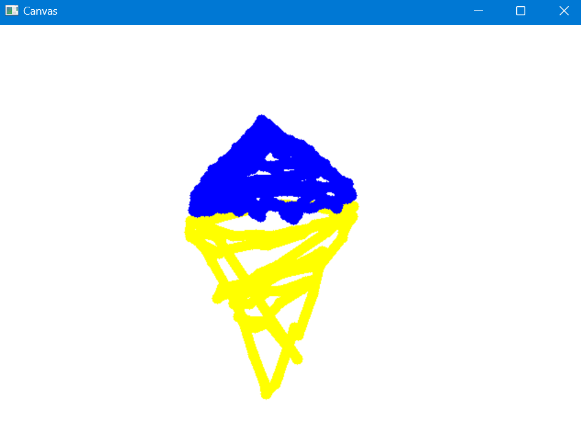
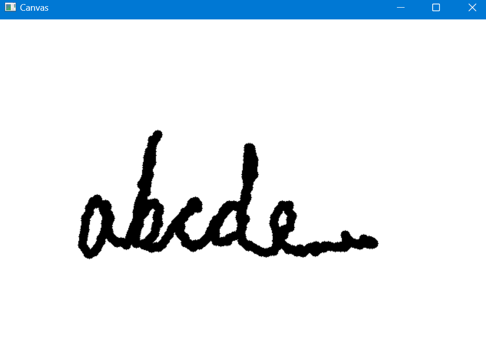

<h1>Air Paint</h1>
<h2>As the name suggests, air paint allows you to paint pictures by moving your index finger in the air like a brush. You can select different colors and can clear the entire canvas whenever you like. The program uses OpenCV to video capture and Mediapipe Hands to detect the hand landmarks of the user.</h2>

